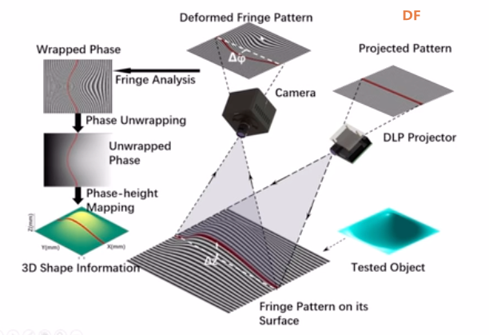

# 关于深度相机的选型

## 1.结构光投射
* Kinect 
* Astra Pro Plus
* Gemini 335L

**技术原理**
1. 光投射：Kinect设备内部有一个红外光源，可以将一系列特定的红外光图案（例如点阵图案）投射到场景上。

2. 图案变形：当这些红外光图案被场景中的物体反射时，图案会由于物体的几何形状和位置而发生变形。
3. 红外摄像头捕捉：Kinect 还配备了红外摄像头来捕捉反射光图案。
4. 深度计算：通过将原始投影图案与变形的反射图案进行比较，Kinect 可以计算每个像素的深度信息 - 即该像素到相机的距离。
5. 生成深度图：基于上述深度信息，Kinect 生成深度图，其中每个像素的值代表该像素到相机的距离。

